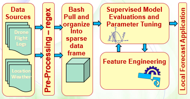

Real Time Picture Quality Prediction from an Agricultural Drone Flight Logs
===========================================================================

An agricultural drone takes snapshots of a field during its flight to categorize crop quality. The quality of the picture is influenced by the smoothness of the flight which is reflected in the drone's time series telemetry mavlogdump logs. Using these logs and blending in third party forecast.io weather data, predictive models were compared to find the best predictor for flight's quality score. The resulting model can be used in the field to allow for another re-run of the flight.  Currently the pilot needs to wait for the data to be uploaded and manually scored at another site. If the flight needs to be re-run, the pilot returns to the site the next day and re-launches.

### Author

*Nancy Abramson* 
[nabramson@ieee.org](mailto:nabramson@ieee.org) 
in/nancyabramson 
github.com/nwabramson 
January 2016

### Overview

Each of the 593 binary files that I recieved is a record of a drone flight. Each flight has an associated quality score. The flights are from different vehichles and may have recorded different events. For each flight, each event is rolled together with any other events for the same timestamp. This results in a sparse matrix because only some events are recorded at a time period. The flight is summarized with each event's minimum, maximum, standard deviation,  and median values for use in the forecasting model. Addition features of weather, radio signal strength, and flight duration were inclued to support quality prediction.

### Project Goals

This project aims to

* provide a tool to read the flight and predict the picture quality remotely
* apply machine learning techniques to provide insight on drone performance and picture quality.

### A Machine Learning Framework for Predicting Drone Picture Quality

### Folder Contents

The different elements of the project have been separated into several folders.  A quick overview is below; detailed information can be found in each folder.

*	*code* 
	Data ingestion and organization scripts and methods.

*	*presentation* 
	Power point presentation of results.

